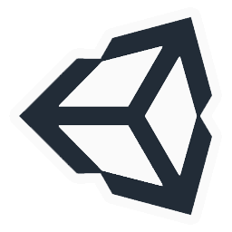
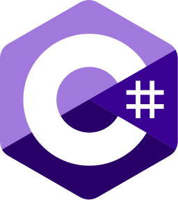

## Hi I'm Eric
I am  a Computer Science student seeking to become a game developer.

### Connect With Me
[][itchio]
[][linkedin]

 
 

### Languages And Tools
[][unity]
[][unreal]
[][csharp]
[][cpp]
[][c]
[][pyhon]

<!-- Links to social medias -->
[itchio]: https://ericgomes.itch.io/
[linkedin]: https://www.linkedin.com/in/eric-gregory-16a502183/

<!-- Links to Technologies -->
[unity]: https://docs.unity3d.com/Manual/index.html
[unreal]: https://docs.unrealengine.com/4.27/en-US/
[csharp]: https://docs.unity3d.com/ScriptReference/
[cpp]: https://www.cplusplus.com/reference/
[c]: https://docs.microsoft.com/pt-br/cpp/c-language/?view=msvc-160
[python]: https://docs.python.org/3/
